# Data Flow Diagrams

Visual representation of how data flows through the application.

---

## Authentication Flow

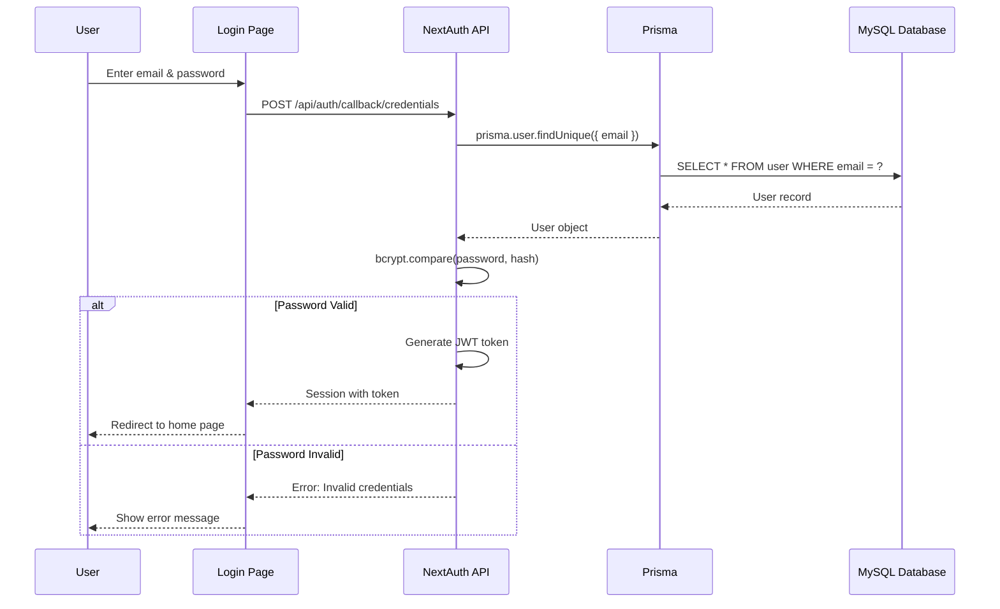

---

## Registration Flow

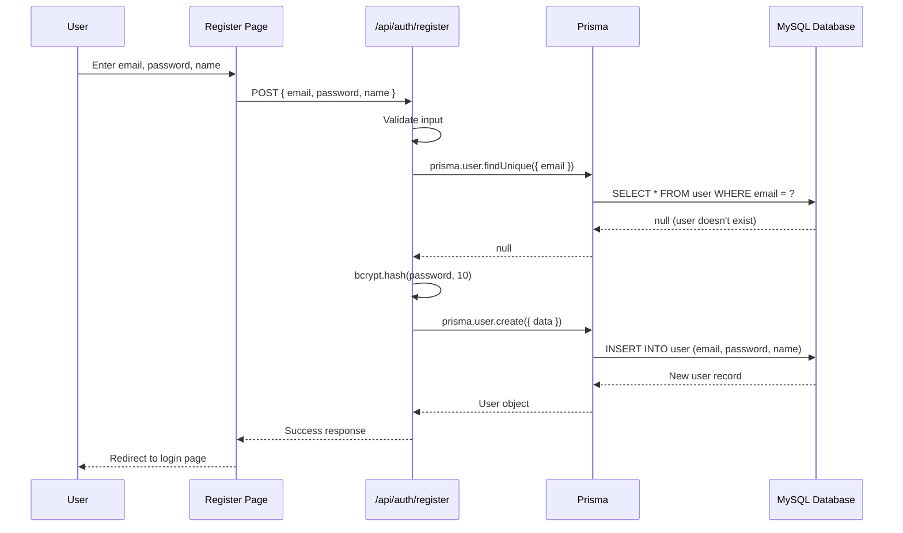

---

## Add to Cart Flow

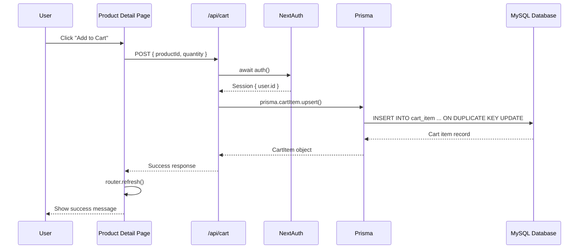

---

## Checkout & Order Creation Flow

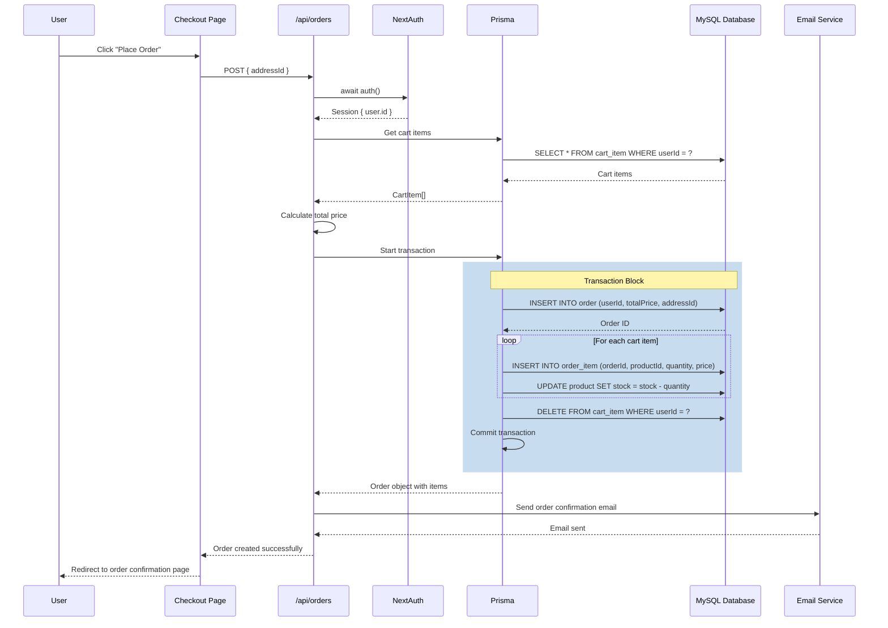

---

## Product Listing Flow (Server-Side)

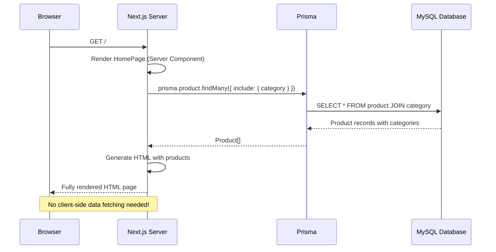

---

## Admin Order Status Update Flow

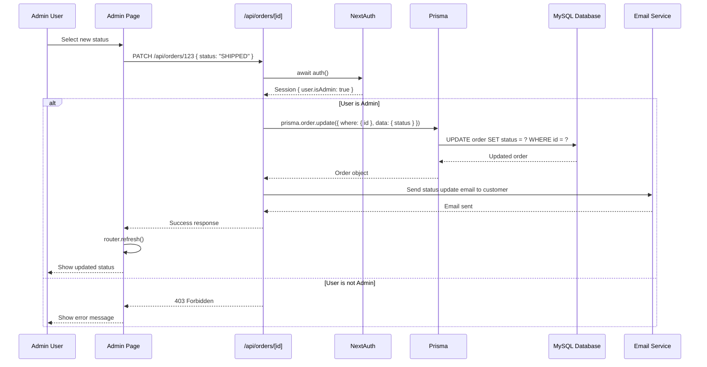

---

## Wishlist Management Flow

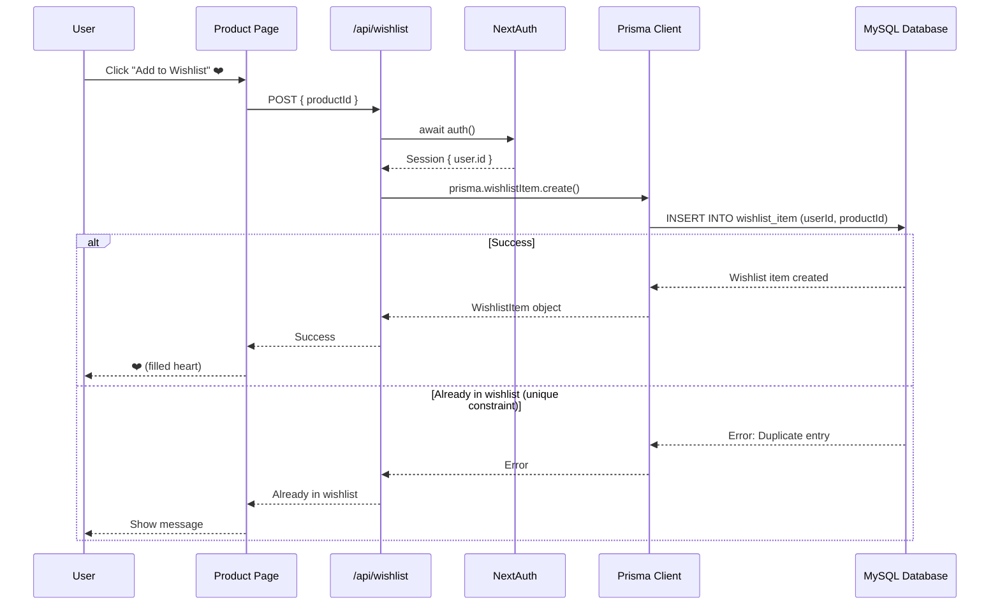

---

## Session Management Flow

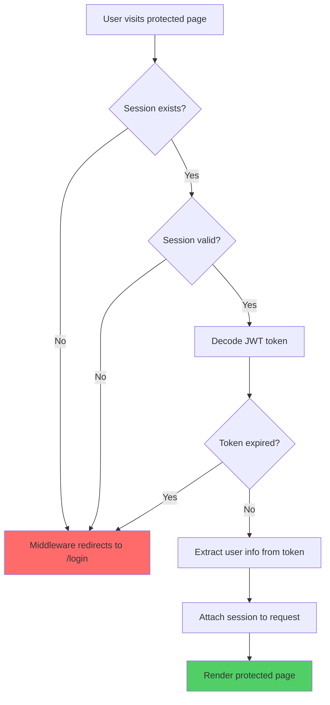

---

## API Route Protection Pattern

```mermaid
flowchart TD
    A[API Request] --> B[API Route Handler]
    B --> C{Requires Auth?}
    
    C -->|No| D[Execute business logic]
    C -->|Yes| E[await auth()]
    
    E --> F{Session exists?}
    F -->|No| G[Return 401 Unauthorized]
    F -->|Yes| H{Admin required?}
    
    H -->|No| D
    H -->|Yes| I{User is Admin?}
    
    I -->|No| J[Return 403 Forbidden]
    I -->|Yes| D
    
    D --> K[Prisma query]
    K --> L[Return response]
    
    style G fill:#ff6b6b
    style J fill:#ff6b6b
    style L fill:#51cf66
```

---

## Component Rendering Strategy

```mermaid
graph TB
    subgraph "Server Components (Default)"
        A[Page.tsx] --> B[Fetch data from Prisma]
        B --> C[Render HTML on server]
        C --> D[Send to browser]
    end
    
    subgraph "Client Components ('use client')"
        E[AddToCartButton.tsx] --> F[Handle user interactions]
        F --> G[Make API calls]
        G --> H[Update UI]
    end
    
    subgraph "Hybrid Approach"
        I[ProductDetailPage] --> J[Server: Fetch product data]
        J --> K[Server: Render product info]
        K --> L[Client: AddToCartButton]
        L --> M[Client: Handle cart actions]
    end
    
    style A fill:#61dafb
    style E fill:#ffd43b
    style I fill:#a9e34b
```

---

## Database Query Optimization

### N+1 Query Problem (Avoided with Prisma)

**Bad (Spring Boot - Potential N+1):**
```java
// 1 query to get orders
List<Order> orders = orderRepository.findAll();

// N queries to get items for each order
for (Order order : orders) {
    List<OrderItem> items = order.getItems(); // Lazy loading triggers query
}
```

**Good (Next.js with Prisma):**
```typescript
// Single query with JOIN
const orders = await prisma.order.findMany({
  include: {
    items: {
      include: { product: true }
    },
    address: true,
    user: true
  }
})
```

### Query Flow Diagram

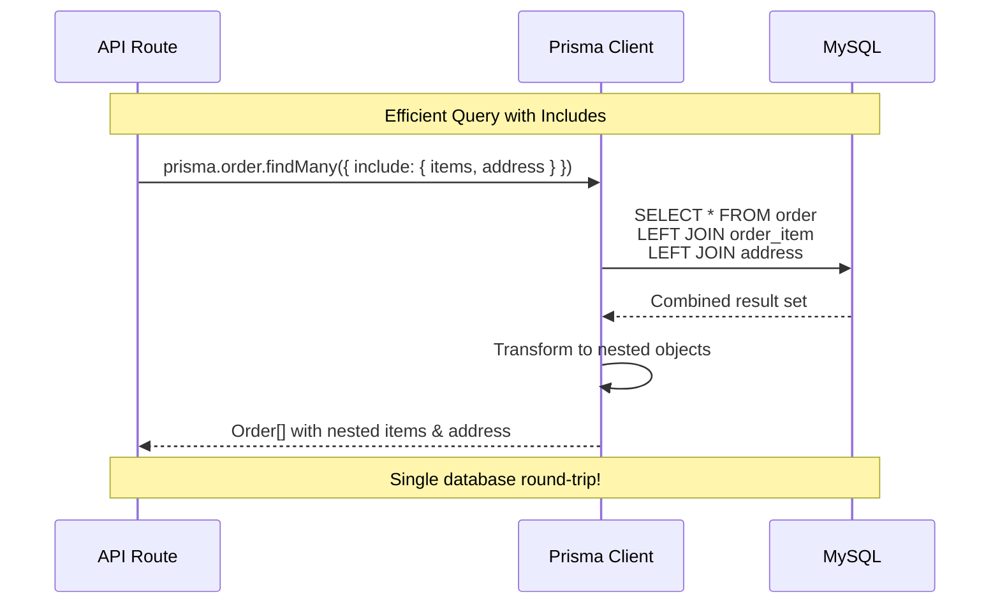

---

## Deployment Architecture

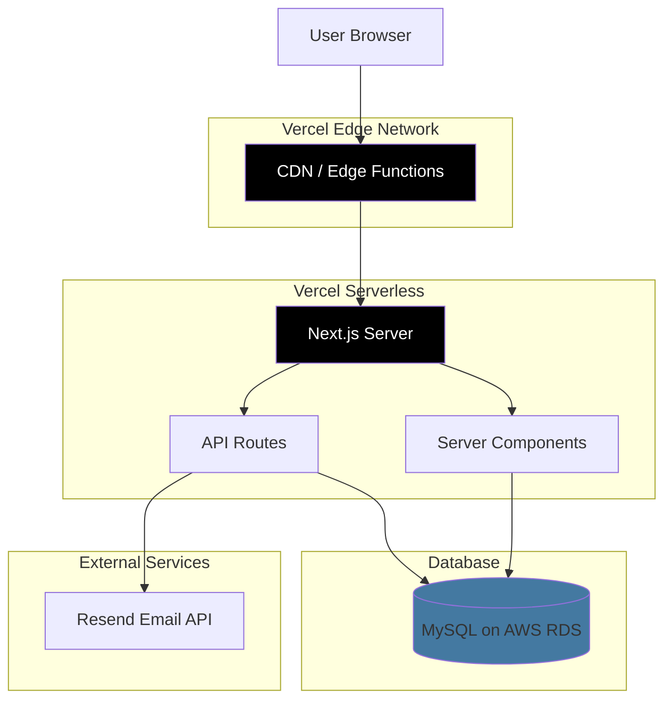

---

## Migration Data Flow

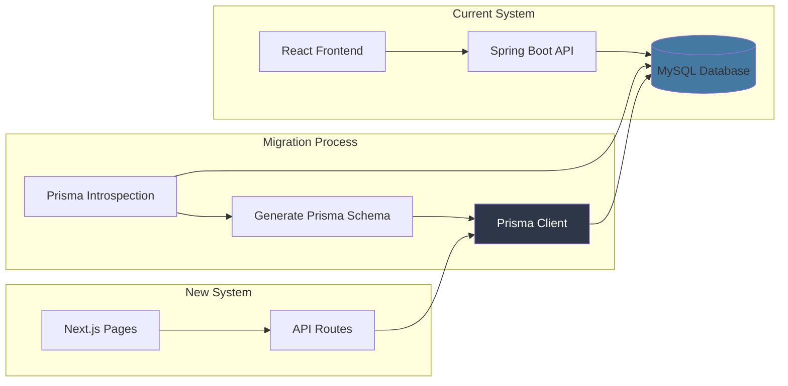

---

## Performance Comparison

### Current Stack Request Flow
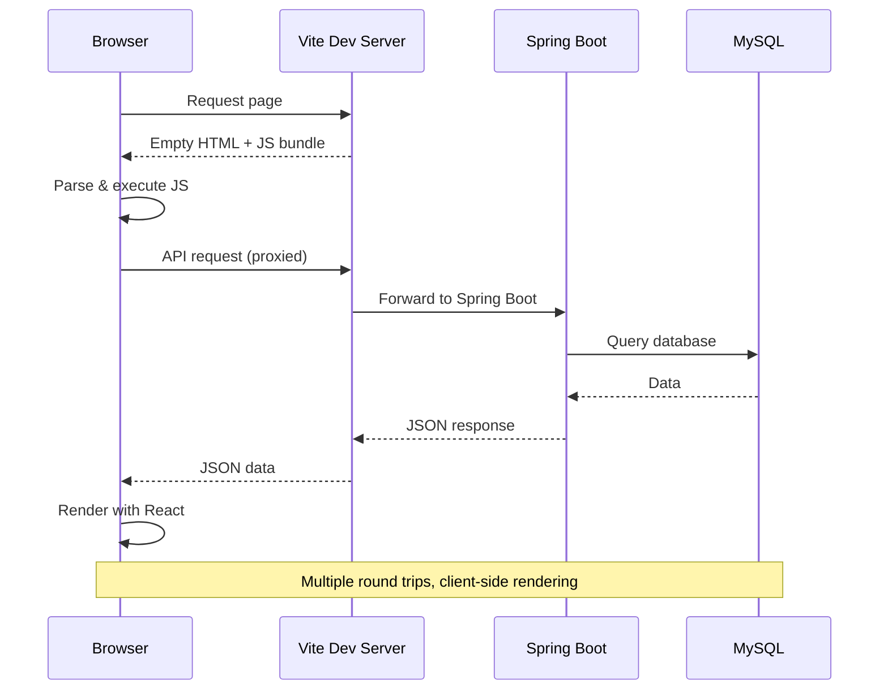

### Next.js Request Flow
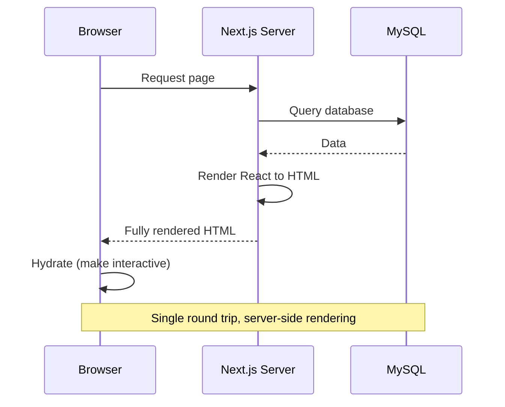

---

## Key Takeaways

1. **Simplified Architecture**: One server instead of two
2. **Better Performance**: Server-side rendering reduces client work
3. **Type Safety**: End-to-end TypeScript
4. **Efficient Queries**: Prisma prevents N+1 problems
5. **Modern Auth**: NextAuth.js handles sessions seamlessly
6. **Scalable**: Vercel edge network for global distribution
