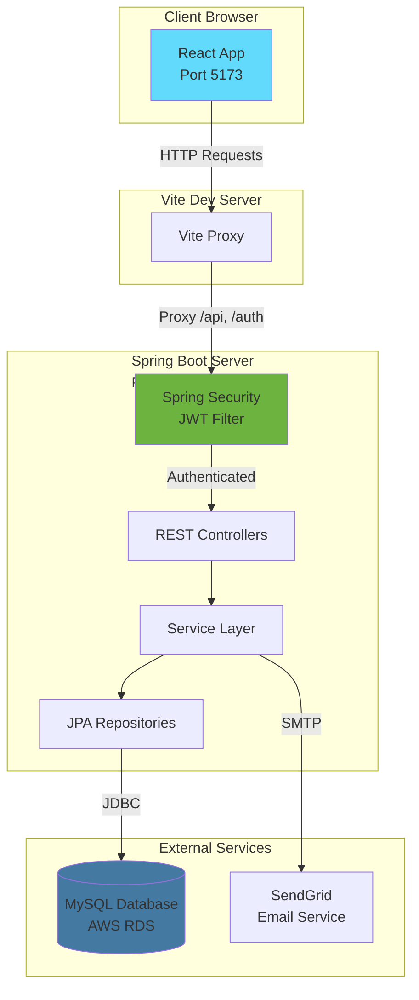
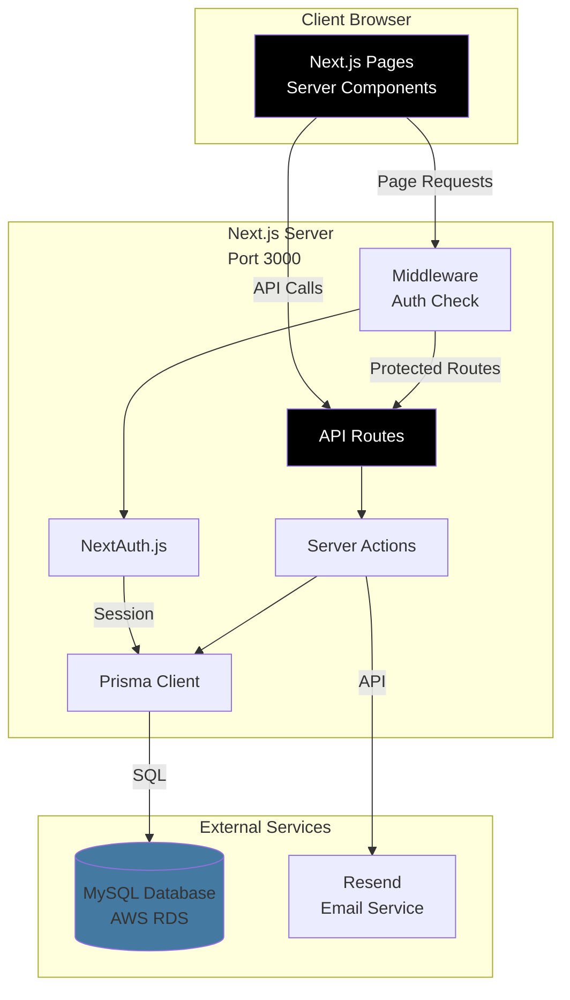
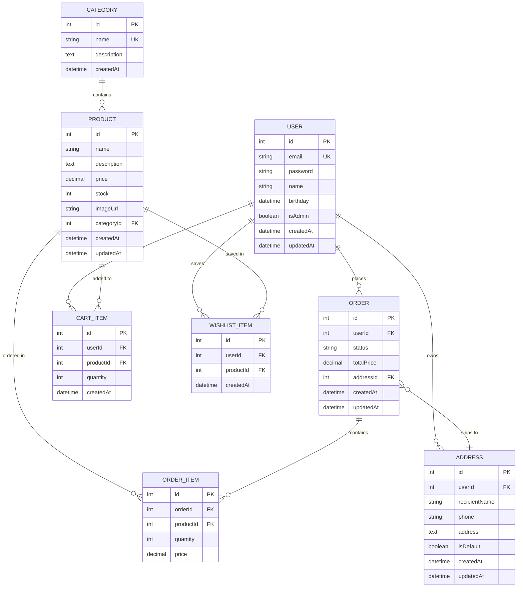

# VocaloCart → Next.js Migration Plan

## Overview

This document outlines the complete migration strategy from React + Spring Boot to Next.js 15 full-stack.

**Timeline:** 7-9 days  
**Expected Reduction:** 70% less code, 90% faster builds, 75% lower memory usage

---

## Architecture Comparison

### Current Stack Architecture



**Current Stack:**
- Frontend: React 19 + Vite (Port 5173)
- Backend: Spring Boot 3.5.6 + Java 21 (Port 8081)
- Database: MySQL 8.0 (AWS RDS)
- Auth: Spring Security + JWT
- ORM: JPA/Hibernate
- Email: Spring Mail + SendGrid

---

### Target Stack Architecture



**Target Stack:**
- Full-Stack: Next.js 15 (App Router)
- Database: MySQL 8.0 (same database)
- Auth: NextAuth.js v5
- ORM: Prisma
- Email: Resend
- Hosting: Vercel

---

## Database Entity Relationship Diagram



---

## Current Project Structure

### React Frontend (vocaloid_front/)

```
vocaloid_front/
├── src/
│   ├── api/
│   │   └── axiosConfig.ts          # Axios setup with interceptors
│   ├── components/
│   │   ├── Navbar.tsx              # Navigation bar
│   │   ├── Footer.tsx              # Footer component
│   │   ├── PageTransition.tsx      # Page animations
│   │   └── ToastProvider.tsx       # Toast notifications
│   ├── context/
│   │   ├── AuthContext.tsx         # Auth state management
│   │   ├── CartContext.tsx         # Cart state management
│   │   ├── ThemeContext.tsx        # Dark/light mode
│   │   └── ToastContext.tsx        # Toast state
│   ├── hooks/
│   │   ├── useAuth.ts              # Auth hook
│   │   ├── useCart.ts              # Cart hook
│   │   ├── useThemeMode.ts         # Theme hook
│   │   └── useToast.ts             # Toast hook
│   ├── pages/
│   │   ├── HomePage.tsx            # Landing page
│   │   ├── ProductDetail.tsx       # Product details
│   │   ├── CartPage.tsx            # Shopping cart
│   │   ├── CheckoutPage.tsx        # Checkout flow
│   │   ├── OrderHistoryPage.tsx    # Order history
│   │   ├── WishlistPage.tsx        # Wishlist
│   │   ├── AddressesPage.tsx       # Address management
│   │   ├── AdminOrdersPage.tsx     # Admin panel
│   │   ├── ContactPage.tsx         # Contact form
│   │   ├── LoginPage.tsx           # Login
│   │   ├── RegisterPage.tsx        # Registration
│   │   └── MyPage.tsx              # User profile
│   ├── styles/
│   │   ├── GlobalStyle.ts          # Global CSS
│   │   ├── theme.ts                # Theme config
│   │   └── designSystem.ts         # Design tokens
│   ├── App.tsx                     # Main app component
│   └── main.tsx                    # Entry point
├── public/
├── index.html
├── package.json
├── vite.config.ts
└── tsconfig.json
```

### Spring Boot Backend (vocaloidshop/)

```
vocaloidshop/
├── src/main/java/mjyuu/vocaloidshop/
│   ├── controller/
│   │   ├── AuthController.java         # Login, register, profile
│   │   ├── ProductController.java      # Product CRUD
│   │   ├── CategoryController.java     # Category management
│   │   ├── CartController.java         # Cart operations
│   │   ├── OrderController.java        # Order management
│   │   ├── AddressController.java      # Address CRUD
│   │   ├── WishlistController.java     # Wishlist operations
│   │   └── ContactController.java      # Contact form
│   ├── entity/
│   │   ├── User.java                   # User entity
│   │   ├── Product.java                # Product entity
│   │   ├── Category.java               # Category entity
│   │   ├── Order.java                  # Order entity
│   │   ├── OrderItem.java              # Order item entity
│   │   ├── OrderStatus.java            # Order status enum
│   │   ├── CartItem.java               # Cart item entity
│   │   ├── Address.java                # Address entity
│   │   └── WishlistItem.java           # Wishlist item entity
│   ├── repository/
│   │   ├── UserRepository.java         # JPA repository
│   │   ├── ProductRepository.java
│   │   ├── CategoryRepository.java
│   │   ├── OrderRepository.java
│   │   ├── OrderItemRepository.java
│   │   ├── CartItemRepository.java
│   │   ├── AddressRepository.java
│   │   └── WishlistItemRepository.java
│   ├── service/
│   │   ├── AuthService.java            # Auth business logic
│   │   ├── ProductService.java
│   │   ├── CartService.java
│   │   ├── OrderService.java
│   │   ├── AddressService.java
│   │   ├── WishlistService.java
│   │   └── ContactService.java
│   ├── security/
│   │   ├── SecurityConfig.java         # Spring Security config
│   │   ├── JwtAuthFilter.java          # JWT filter
│   │   └── JwtUtil.java                # JWT utilities
│   ├── dto/
│   │   ├── AuthRequestDTO.java         # Login/register DTOs
│   │   ├── AuthResponseDTO.java
│   │   ├── ProductRequestDTO.java
│   │   ├── ProductResponseDTO.java
│   │   └── ... (other DTOs)
│   ├── exception/
│   │   ├── GlobalExceptionHandler.java
│   │   ├── ResourceNotFoundException.java
│   │   └── InvalidCredentialsException.java
│   └── VocaloidshopApplication.java    # Main class
├── src/main/resources/
│   ├── application.yml                 # Configuration
│   └── db/migration/                   # Flyway migrations
├── pom.xml                             # Maven dependencies
└── target/                             # Build output
```

---

## Target Next.js Project Structure

```
vocalocart-nextjs/
├── src/
│   ├── app/                            # App Router (Next.js 15)
│   │   ├── (auth)/                     # Auth route group (no layout)
│   │   │   ├── login/
│   │   │   │   └── page.tsx           # Login page
│   │   │   └── register/
│   │   │       └── page.tsx           # Register page
│   │   │
│   │   ├── (shop)/                     # Main shop route group
│   │   │   ├── page.tsx               # Home page
│   │   │   ├── products/
│   │   │   │   └── [id]/
│   │   │   │       └── page.tsx       # Product detail (dynamic)
│   │   │   ├── cart/
│   │   │   │   └── page.tsx           # Shopping cart
│   │   │   ├── checkout/
│   │   │   │   └── page.tsx           # Checkout page
│   │   │   ├── orders/
│   │   │   │   └── page.tsx           # Order history
│   │   │   ├── wishlist/
│   │   │   │   └── page.tsx           # Wishlist
│   │   │   └── addresses/
│   │   │       └── page.tsx           # Address management
│   │   │
│   │   ├── (user)/                     # User route group
│   │   │   ├── profile/
│   │   │   │   └── page.tsx           # User profile
│   │   │   └── contact/
│   │   │       └── page.tsx           # Contact form
│   │   │
│   │   ├── admin/                      # Admin route group
│   │   │   ├── layout.tsx             # Admin layout
│   │   │   └── orders/
│   │   │       └── page.tsx           # Admin orders panel
│   │   │
│   │   ├── api/                        # API Routes
│   │   │   ├── auth/
│   │   │   │   ├── [...nextauth]/
│   │   │   │   │   └── route.ts       # NextAuth handler
│   │   │   │   └── register/
│   │   │   │       └── route.ts       # Register endpoint
│   │   │   ├── products/
│   │   │   │   ├── route.ts           # GET, POST /api/products
│   │   │   │   └── [id]/
│   │   │   │       └── route.ts       # GET, PUT, DELETE /api/products/[id]
│   │   │   ├── categories/
│   │   │   │   └── route.ts           # Categories CRUD
│   │   │   ├── cart/
│   │   │   │   └── route.ts           # Cart operations
│   │   │   ├── orders/
│   │   │   │   ├── route.ts           # GET, POST orders
│   │   │   │   └── [id]/
│   │   │   │       └── route.ts       # GET, PATCH order by ID
│   │   │   ├── addresses/
│   │   │   │   ├── route.ts           # GET, POST addresses
│   │   │   │   └── [id]/
│   │   │   │       └── route.ts       # PUT, DELETE address
│   │   │   ├── wishlist/
│   │   │   │   └── route.ts           # Wishlist operations
│   │   │   ├── contact/
│   │   │   │   └── route.ts           # Contact form handler
│   │   │   └── admin/
│   │   │       └── orders/
│   │   │           └── route.ts       # Admin: all orders
│   │   │
│   │   ├── layout.tsx                  # Root layout (navbar, footer)
│   │   ├── globals.css                 # Global styles
│   │   ├── page.tsx                    # Root redirect
│   │   └── not-found.tsx               # 404 page
│   │
│   ├── components/                     # Reusable components
│   │   ├── ui/                         # UI primitives
│   │   │   ├── Button.tsx
│   │   │   ├── Card.tsx
│   │   │   ├── Input.tsx
│   │   │   └── Badge.tsx
│   │   ├── Navbar.tsx                  # Navigation bar
│   │   ├── Footer.tsx                  # Footer
│   │   ├── ProductCard.tsx             # Product card component
│   │   ├── CartItemRow.tsx             # Cart item display
│   │   ├── OrderStatusBadge.tsx        # Order status indicator
│   │   ├── AddToCartButton.tsx         # Add to cart (client)
│   │   ├── LogoutButton.tsx            # Logout button (client)
│   │   └── ThemeToggle.tsx             # Dark mode toggle (client)
│   │
│   ├── lib/                            # Utility libraries
│   │   ├── prisma.ts                   # Prisma client singleton
│   │   ├── auth.ts                     # NextAuth configuration
│   │   ├── email.ts                    # Email utilities (Resend)
│   │   ├── utils.ts                    # Helper functions
│   │   └── validations.ts              # Zod schemas
│   │
│   └── types/                          # TypeScript types
│       ├── next-auth.d.ts              # NextAuth type extensions
│       └── index.ts                    # Shared types
│
├── prisma/
│   ├── schema.prisma                   # Database schema
│   └── migrations/                     # Migration history
│
├── public/                             # Static assets
│   ├── images/
│   └── favicon.ico
│
├── .env.local                          # Environment variables (local)
├── .env.example                        # Example env file
├── .gitignore
├── next.config.js                      # Next.js configuration
├── tailwind.config.ts                  # Tailwind CSS config
├── tsconfig.json                       # TypeScript config
├── package.json                        # Dependencies
└── README.md                           # Project documentation
```

### Folder Structure Explanation

**Route Groups** (folders with parentheses):
- `(auth)` - Authentication pages without main layout
- `(shop)` - Main shopping pages with navbar/footer
- `(user)` - User-specific pages
- These don't affect URL structure

**Dynamic Routes** (folders with brackets):
- `[id]` - Dynamic parameter (e.g., `/products/123`)
- `[...nextauth]` - Catch-all route for NextAuth

**File Conventions**:
- `page.tsx` - Page component (creates route)
- `layout.tsx` - Shared layout wrapper
- `route.ts` - API route handler
- `loading.tsx` - Loading UI (optional)
- `error.tsx` - Error boundary (optional)

---

## Migration Phases

### Phase 1: Setup (Day 1)
1. Create Next.js project
2. Install dependencies (next-auth, prisma, bcryptjs, resend)
3. Initialize Prisma
4. Configure database connection
5. Create Prisma schema from existing database
6. Generate Prisma client

### Phase 2: Authentication (Day 1-2)
1. Set up NextAuth.js configuration
2. Create login/register pages
3. Implement JWT session handling
4. Create protected route middleware
5. Test authentication flow

### Phase 3: API Routes (Day 2-3)
Migrate Spring Boot controllers to Next.js API routes:
- ✅ Products API (GET, POST, PUT, DELETE)
- ✅ Cart API (GET, POST, DELETE)
- ✅ Orders API (GET, POST, PATCH)
- ✅ Addresses API (GET, POST, PUT, DELETE)
- ✅ Wishlist API (GET, POST, DELETE)
- ✅ Contact API (POST)
- ✅ Categories API (GET, POST)
- ✅ Admin API (GET all orders, update status)

### Phase 4: Frontend Pages (Day 3-5)
Migrate React pages to Next.js App Router:
- ✅ Home page (Server Component with product list)
- ✅ Product detail (Dynamic route with SSR)
- ✅ Cart page (Protected route)
- ✅ Checkout page (Protected route)
- ✅ Orders page (Protected route)
- ✅ Wishlist page (Protected route)
- ✅ Addresses page (Protected route)
- ✅ Profile page (Protected route)
- ✅ Admin page (Admin-only route)

### Phase 5: Components (Day 5-6)
- Navbar
- Footer
- Client components (AddToCart, etc.)

### Phase 6: Styling (Day 6)
- Tailwind configuration
- Global styles
- Responsive design

### Phase 7: Testing & Deployment (Day 7)
- Manual testing
- Build verification
- Deploy to Vercel

---

## Key Decisions

### Database
**Decision:** Keep MySQL (minimize migration risk)
- Prisma supports MySQL
- No data migration needed
- Can migrate to PostgreSQL later if desired

### Authentication
**Change:** Spring Security → NextAuth.js
- All users will need to re-login after migration
- JWT tokens will be invalidated
- Session management will be different

### API Structure
**Change:** REST endpoints will change
- Old: `http://localhost:8081/api/products`
- New: `http://localhost:3000/api/products`
- Internal structure changes but external API remains similar

---

## Risk Mitigation

### High-Risk Areas
1. **Database Migration** - Create full backup before starting
2. **Authentication** - All users logged out during migration
3. **Order Processing** - Disable checkout during migration
4. **Email Service** - Test thoroughly before going live

### Rollback Plan
1. Keep old Spring Boot + React system running
2. Database backup ready to restore
3. DNS can be reverted to old system
4. Gradual rollout via staging first

---

## Next Steps

1. Review this plan
2. Create database backup
3. Begin Phase 1: Setup
4. Follow phase-by-phase execution
5. Test on staging
6. Production deployment

---

## Reference Documents

- **`NEXTJS_SETUP_GUIDE.md`** - Detailed setup instructions with step-by-step commands
- **`PRISMA_SCHEMA.md`** - Complete database schema with usage examples
- **`API_MIGRATION_GUIDE.md`** - API endpoint mapping and code comparisons
- **`AUTH_SETUP_GUIDE.md`** - Authentication setup with NextAuth.js
- **`DATA_FLOW_DIAGRAMS.md`** - Visual diagrams of data flows and architecture

## Visual Diagrams Included

This migration plan includes:
- ✅ Current vs Target architecture diagrams
- ✅ Database entity relationship diagram (ERD)
- ✅ Complete folder structure for both stacks
- ✅ Data flow sequence diagrams (see `DATA_FLOW_DIAGRAMS.md`)
- ✅ Component rendering strategy diagrams
- ✅ Authentication and authorization flows
